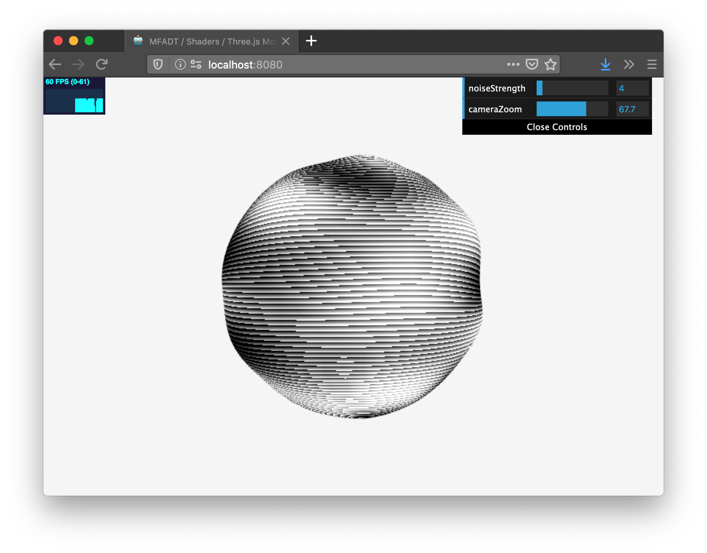

### MFADT / Shaders / Three.js Modules

Class repository for workshop on using Three.js and Webpack to divide a Three.js project into separate files.

We will be using the following libraries: [three.js](https://threejs.org/), [webpack](https://webpack.js.org/), [babel](https://babeljs.io/), [dat.gui](https://github.com/dataarts/dat.gui)



### system requirements

- Node.js version 13.12.0 or higher
- NPM version 6.14.4 or higher

### getting started

```bash
git clone https://github.com/zachkrall/mfadt-threejs-modules.git
cd mfadt-threejs-modules
```

install dependencies

```bash
npm install
```

start dev server

```bash
npm run dev
```

### folder structure

**src/**
<br/>&nbsp;&nbsp;&nbsp;&nbsp;**components/**
<br/>&nbsp;&nbsp;&nbsp;&nbsp;&nbsp;&nbsp;&nbsp;&nbsp;**Camera.js**: extends three.js camera class
<br/>&nbsp;&nbsp;&nbsp;&nbsp;&nbsp;&nbsp;&nbsp;&nbsp;**Renderer.js**: extends three.js renderer class
<br/>&nbsp;&nbsp;&nbsp;&nbsp;**objects/**
<br/>&nbsp;&nbsp;&nbsp;&nbsp;&nbsp;&nbsp;&nbsp;&nbsp;**Ball.js**: extends three.js mesh
<br/>&nbsp;&nbsp;&nbsp;&nbsp;**shader/**
<br/>&nbsp;&nbsp;&nbsp;&nbsp;&nbsp;&nbsp;&nbsp;&nbsp;**functions/**: various GLSL functions
<br/>&nbsp;&nbsp;&nbsp;&nbsp;&nbsp;&nbsp;&nbsp;&nbsp;**\_frag.js**: example fragment shader
<br/>&nbsp;&nbsp;&nbsp;&nbsp;&nbsp;&nbsp;&nbsp;&nbsp;**\_vert.js**: example vertex shader
<br/>&nbsp;&nbsp;&nbsp;&nbsp;&nbsp;&nbsp;&nbsp;&nbsp;**shaders.js**: holds shader materials
<br/>&nbsp;&nbsp;&nbsp;&nbsp;**main.js**

---

Design + Technology / Parsons School of Design
<br/>_Currents: Experimental Shaders_ / Faculty: Justin Bakse
<br/>Spring 2020 / PSAM 5600 / CRN 7776

http://compform.net/experimental_shaders/
